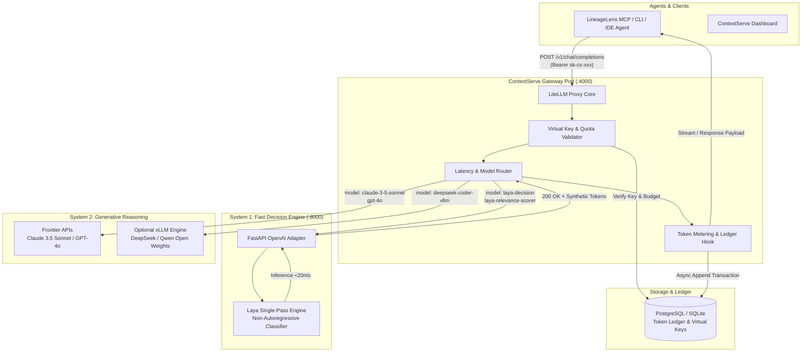
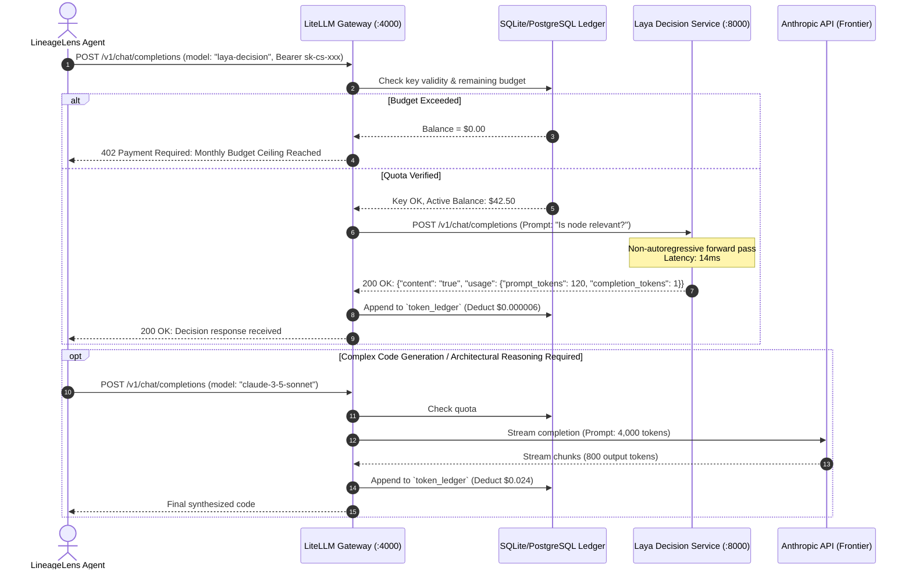

# Hybrid AI Token Gateway Specification: LiteLLM + Laya (System 1 / System 2)

> **Document:** `docs/hybrid-token-gateway-litellm-laya-spec.md`  
> **Version:** 1.0  
> **Status:** Ready for Implementation  
> **Reference:** `business_cases/business_case_and_arch_spec_litellm_laya.md`  
> **Applies to:** `lineagelens` MCP server & CLI · `contextserve` Gateway & Backend · `laya` Decision Engine  

---

## 1. Executive Summary & Objective

Modern autonomous software engineering agents (LineageLens, Cursor, Claude Code, Copilot Workspace) execute tens of thousands of LLM queries per developer each month. Telemetry analysis indicates that **40%–60% of agent calls are simple decision primitives**:
* AST relevance filtering (*"Does this function signature belong to the query target?"*)
* Search continuation checks (*"Do we have enough graph context or should we continue expanding callers?"*)
* Categorical classification (*"Is this error an authentication failure or a network timeout?"*)
* Gating & safety validation.

Routing these high-frequency, low-complexity operations to frontier autoregressive LLMs (e.g., Claude 3.5 Sonnet, GPT-4o) via third-party hosted aggregators like **OpenRouter** introduces:
1. **Third-Party Markup / Billing Fees**: Paying unnecessary margins and transaction buffers on millions of daily tokens.
2. **High Latency Floor**: 400ms–1500ms round-trip latency for simple binary/typed decisions.
3. **Data Egress Risks**: Proprietary code context traversing external brokers outside private enterprise VPCs.
4. **No Custom Model Hosting**: Inability to host proprietary, private, or specialized models on OpenRouter.

### System Solution
This specification establishes a **100% self-hosted, sovereign Hybrid Token Gateway** comprising:
* **Gateway Layer (LiteLLM Proxy)**: High-throughput, open-source proxy providing unified OpenAI-compatible routing, virtual key generation, token counting, multi-tenant budget caps, and zero gateway surcharge.
* **System 1 Engine (Laya — `NandhaKishorM/laya`)**: Non-autoregressive decision engine running on CPU or low-cost GPU (T4/L4), completing typed decisions, scoring, and binary gating in a single forward pass in **< 20ms** at **~$0.00000005 per token**.
* **System 2 Engine (Frontier LLMs / vLLM)**: Deep multi-step reasoning and code generation models invoked only when escalated by System 1 or explicitly requested by the agent.
* **ContextServe Ledger & Metering**: Double-entry token transaction ledger for auditability, enterprise chargeback, and SaaS customer billing.

---

## 2. System Architecture & Topology



---

## 3. Component Design & Specifications

### 3.1 Laya Decision Adapter (`services/laya-service`)

Laya (`NandhaKishorM/laya`) operates as a **non-autoregressive classifier and scorer** over text. It does not generate text token-by-token. To allow LiteLLM and standard OpenAI SDKs to communicate with Laya seamlessly, a lightweight FastAPI service wraps Laya.

#### Responsibilities:
1. Expose standard OpenAI-compatible `/v1/chat/completions` and `/v1/models`.
2. Expose high-performance native decision RPC `/v1/decisions`.
3. Compute exact synthetic token usage (`prompt_tokens = len(prompt) // 4`, `completion_tokens = len(output) // 4`) for LiteLLM's ledger.
4. Maintain p99 latency under **25ms**.

#### Service Implementation (`services/laya-service/main.py`):
```python
"""
ContextServe Laya Decision Engine Adapter
Exposes an OpenAI-compatible interface for LiteLLM routing.
"""
import time
import uuid
from typing import Any, Dict, List, Optional
from fastapi import FastAPI, HTTPException, Request, status
from pydantic import BaseModel, Field
import laya

app = FastAPI(
    title="ContextServe Laya Decision Engine",
    version="1.0.0",
    docs_url="/docs"
)

# Load Laya model into memory on startup
engine = None

@app.on_event("startup")
def load_laya():
    global engine
    # Supports torch-backend: 'auto', 'cpu', 'cuda'
    engine = laya.load_engine(torch_backend="auto")

class ChatMessage(BaseModel):
    role: str
    content: str

class ChatCompletionRequest(BaseModel):
    model: str
    messages: List[ChatMessage]
    temperature: Optional[float] = 0.0
    max_tokens: Optional[int] = 16
    stream: Optional[bool] = False

@app.get("/healthz")
def healthcheck():
    return {"status": "ok", "engine": "laya", "ready": engine is not None}

@app.get("/v1/models")
def list_models():
    return {
        "object": "list",
        "data": [
            {"id": "laya-decision", "object": "model", "owned_by": "contextserve"},
            {"id": "laya-relevance-scorer", "object": "model", "owned_by": "contextserve"}
        ]
    }

@app.post("/v1/chat/completions")
async def chat_completions(req: ChatCompletionRequest):
    if engine is None:
        raise HTTPException(status_code=503, detail="Laya engine not initialized")
    
    start_time = time.perf_counter()
    if not req.messages:
        raise HTTPException(status_code=400, detail="messages array cannot be empty")
    
    last_user_message = req.messages[-1].content
    
    # Execute single forward-pass decision or scoring
    if "scorer" in req.model:
        score = engine.score(last_user_message)
        result_text = str(round(float(score), 4))
    else:
        decision = engine.predict_typed(last_user_message)
        result_text = str(decision.value if hasattr(decision, "value") else decision)
    
    duration_ms = (time.perf_counter() - start_time) * 1000.0
    
    # Synthetic token calculation based on standard 4-bytes/token convention
    prompt_tokens = max(1, len(last_user_message.encode("utf-8")) // 4)
    completion_tokens = max(1, len(result_text.encode("utf-8")) // 4)
    total_tokens = prompt_tokens + completion_tokens

    return {
        "id": f"chatcmpl-laya-{uuid.uuid4().hex[:12]}",
        "object": "chat.completion",
        "created": int(time.time()),
        "model": req.model,
        "choices": [
            {
                "index": 0,
                "message": {
                    "role": "assistant",
                    "content": result_text
                },
                "finish_reason": "stop"
            }
        ],
        "usage": {
            "prompt_tokens": prompt_tokens,
            "completion_tokens": completion_tokens,
            "total_tokens": total_tokens
        },
        "latency_ms": round(duration_ms, 2)
    }
```

---

### 3.2 LiteLLM Gateway Configuration (`docker/litellm/config.yaml`)

LiteLLM acts as the single point of entry for all agent traffic.

```yaml
model_list:
  # ========================================================
  # SYSTEM 1: LAYA ULTRA-FAST DECISION & SCORING ENGINES
  # ========================================================
  - model_name: laya-decision
    litellm_params:
      model: openai/laya-decision
      api_base: http://laya-service:8000/v1
      api_key: "internal-laya-secret"
      input_cost_per_token: 0.00000005    # $0.05 per 1M input tokens
      output_cost_per_token: 0.00000005   # $0.05 per 1M output tokens

  - model_name: laya-relevance-scorer
    litellm_params:
      model: openai/laya-relevance-scorer
      api_base: http://laya-service:8000/v1
      api_key: "internal-laya-secret"
      input_cost_per_token: 0.00000005
      output_cost_per_token: 0.00000005

  # ========================================================
  # SYSTEM 2: FRONTIER REASONING (DIRECT PROVIDER PRICING)
  # ========================================================
  - model_name: claude-3-5-sonnet
    litellm_params:
      model: anthropic/claude-3-5-sonnet-20241022
      api_key: os.environ/ANTHROPIC_API_KEY
      input_cost_per_token: 0.000003     # $3.00 per 1M input tokens
      output_cost_per_token: 0.000015    # $15.00 per 1M output tokens

  - model_name: gpt-4o
    litellm_params:
      model: openai/gpt-4o
      api_key: os.environ/OPENAI_API_KEY
      input_cost_per_token: 0.0000025    # $2.50 per 1M input tokens
      output_cost_per_token: 0.0000100   # $10.00 per 1M output tokens

  # ========================================================
  # OPTIONAL: ON-PREMISE vLLM REASONING (OPEN WEIGHTS)
  # ========================================================
  - model_name: deepseek-coder
    litellm_params:
      model: openai/deepseek-ai/DeepSeek-Coder-V2-Lite
      api_base: http://vllm-service:8000/v1
      api_key: "vllm-local-key"
      input_cost_per_token: 0.0000002
      output_cost_per_token: 0.0000002

litellm_settings:
  drop_params: true
  telemetry: false
  request_timeout: 45

general_settings:
  master_key: os.environ/LITELLM_MASTER_KEY
  database_url: os.environ/DATABASE_URL
  store_model_in_db: true
  alerting: ["slack", "email"]

router_settings:
  routing_strategy: "latency-based-routing"
  enable_pre_call_checks: true
  num_retries: 2
  fallbacks:
    - laya-decision: ["claude-3-5-sonnet"]
```

---

## 4. ContextServe Database Schema & Token Ledger

The metering database enforces tenant isolation, budget caps, rate limiting, and real-time balance deductions.

```sql
PRAGMA journal_mode = WAL;
PRAGMA foreign_keys = ON;
PRAGMA synchronous = NORMAL;

-- ============================================================================
-- 1. TENANTS & TEAMS
-- ============================================================================
CREATE TABLE IF NOT EXISTS tenants (
    id                TEXT PRIMARY KEY,              -- 'org_contextserve_001'
    name              TEXT NOT NULL,                 -- 'Core Engineering Platform'
    plan_tier         TEXT NOT NULL DEFAULT 'usage', -- 'developer' | 'growth' | 'enterprise'
    balance_usd       DECIMAL(12, 6) NOT NULL DEFAULT 0.000000, -- Prepaid funds
    currency          TEXT NOT NULL DEFAULT 'USD',
    is_active         BOOLEAN NOT NULL DEFAULT 1,
    created_at        TEXT NOT NULL DEFAULT (strftime('%Y-%m-%dT%H:%M:%fZ', 'now'))
);

-- ============================================================================
-- 2. VIRTUAL API KEYS
-- ============================================================================
CREATE TABLE IF NOT EXISTS virtual_keys (
    key_hash          TEXT PRIMARY KEY,              -- SHA-256 of issued 'sk-cs-...'
    tenant_id         TEXT NOT NULL REFERENCES tenants(id) ON DELETE CASCADE,
    key_name          TEXT NOT NULL,                 -- e.g. 'LineageLens-MCP-Prod'
    max_budget_usd    DECIMAL(10, 4),                -- Hard limit in USD (NULL = unlimited)
    spend_usd         DECIMAL(10, 4) NOT NULL DEFAULT 0.0000,
    rate_limit_rpm    INTEGER DEFAULT 600,
    rate_limit_tpm    INTEGER DEFAULT 200000,
    allowed_models    TEXT,                          -- JSON array: '["laya-decision", "gpt-4o"]'
    expires_at        TEXT,                          -- ISO-8601 UTC string
    is_active         BOOLEAN NOT NULL DEFAULT 1,
    created_at        TEXT NOT NULL DEFAULT (strftime('%Y-%m-%dT%H:%M:%fZ', 'now'))
);

CREATE INDEX IF NOT EXISTS idx_virtual_keys_tenant ON virtual_keys(tenant_id);

-- ============================================================================
-- 3. TOKEN INVOCATION LEDGER (Append-Only Time Series)
-- ============================================================================
CREATE TABLE IF NOT EXISTS token_ledger (
    transaction_id    INTEGER PRIMARY KEY AUTOINCREMENT,
    timestamp         TEXT NOT NULL DEFAULT (strftime('%Y-%m-%dT%H:%M:%fZ', 'now')),
    tenant_id         TEXT NOT NULL REFERENCES tenants(id),
    key_hash          TEXT NOT NULL REFERENCES virtual_keys(key_hash),
    request_id        TEXT NOT NULL UNIQUE,          -- UUID generated by LiteLLM Proxy
    model_name        TEXT NOT NULL,                 -- 'laya-decision' | 'gpt-4o'
    tier              TEXT NOT NULL,                 -- 'system1' | 'system2'
    prompt_tokens     INTEGER NOT NULL,
    completion_tokens INTEGER NOT NULL,
    total_tokens      INTEGER NOT NULL,
    duration_ms       INTEGER NOT NULL,
    cost_raw_usd      DECIMAL(10, 6) NOT NULL,       -- Raw hardware / provider cost
    billed_amount_usd DECIMAL(10, 6) NOT NULL,       -- Billed amount to tenant (with margin)
    remaining_balance DECIMAL(12, 6) NOT NULL,       -- Remaining tenant balance after deduction
    status            TEXT NOT NULL DEFAULT 'ok',    -- 'ok' | 'blocked_quota' | 'error'
    metadata          TEXT                           -- JSON metadata (repo, branch, agent tool)
);

CREATE INDEX IF NOT EXISTS idx_ledger_tenant_time ON token_ledger(tenant_id, timestamp);
CREATE INDEX IF NOT EXISTS idx_ledger_key ON token_ledger(key_hash);
CREATE INDEX IF NOT EXISTS idx_ledger_model ON token_ledger(model_name);
```

---

## 5. End-to-End Execution Sequence

The diagram below details the exact lifecycle of an agent call hitting the hybrid gateway:



---

## 6. Docker Compose Orchestration

Add this configuration to ContextServe's `docker-compose.yml` to run the complete hybrid gateway stack:

```yaml
version: '3.8'

services:
  # -------------------------------------------------------------
  # LAYA SYSTEM 1 DECISION ENGINE
  # -------------------------------------------------------------
  laya-service:
    build:
      context: ./services/laya-service
      dockerfile: Dockerfile
    container_name: contextserve-laya
    restart: unless-stopped
    ports:
      - "8000:8000"
    environment:
      - TORCH_BACKEND=auto
      - WORKERS=4
    healthcheck:
      test: ["CMD", "curl", "-f", "http://localhost:8000/healthz"]
      interval: 10s
      timeout: 5s
      retries: 3

  # -------------------------------------------------------------
  # LITELLM GATEWAY & PROXY
  # -------------------------------------------------------------
  litellm-proxy:
    image: ghcr.io/berriai/litellm:main-latest
    container_name: contextserve-gateway
    restart: unless-stopped
    ports:
      - "4000:4000"
    volumes:
      - ./docker/litellm/config.yaml:/app/config.yaml:ro
      - ./data/gateway:/data
    environment:
      - LITELLM_MASTER_KEY=${LITELLM_MASTER_KEY:-sk-cs-master-secret}
      - DATABASE_URL=sqlite:////data/ledger.sqlite
      - ANTHROPIC_API_KEY=${ANTHROPIC_API_KEY}
      - OPENAI_API_KEY=${OPENAI_API_KEY}
    depends_on:
      laya-service:
        condition: service_healthy
    command: ["--config", "/app/config.yaml", "--port", "4000", "--num_workers", "8"]
```

---

## 7. LineageLens MCP Server Integration

In `src/lineagelens/mcp/server.py`, routing decision queries to the hybrid gateway is straightforward:

```python
import os
import httpx

GATEWAY_URL = os.environ.get("CONTEXTSERVE_GATEWAY_URL", "http://localhost:4000")
GATEWAY_KEY = os.environ.get("CONTEXTSERVE_GATEWAY_KEY", "sk-cs-default")

async def fast_decision(prompt: str) -> str:
    """
    Executes a sub-20ms System 1 decision via the local LiteLLM -> Laya gateway.
    """
    async with httpx.AsyncClient(timeout=2.0) as client:
        resp = await client.post(
            f"{GATEWAY_URL}/v1/chat/completions",
            headers={"Authorization": f"Bearer {GATEWAY_KEY}"},
            json={
                "model": "laya-decision",
                "messages": [{"role": "user", "content": prompt}]
            }
        )
        resp.raise_for_status()
        data = resp.json()
        return data["choices"][0]["message"]["content"]
```

---

## 8. Failure Modes, Fallback Policies & Circuit Breakers

| Failure Mode | Detection | Gateway Fallback Policy |
| :--- | :--- | :--- |
| **Laya Service Down / OOM** | HTTP 500 / Timeout (> 200ms) | Auto-failover to lightweight frontier model (`gpt-4o-mini` or `claude-3-haiku`). Alert operations. |
| **Tenant Balance Depleted** | Remaining balance <= $0.00 | Return `402 Payment Required` with custom payload detailing replenish link. Soft-budget warnings sent at 85%. |
| **Frontier API Rate Limit (429)**| Upstream provider 429 | LiteLLM exponential backoff retry (2 attempts); automatic failover to secondary provider. |
| **Network Partition / Offline** | LiteLLM unreachable | LineageLens falls back to pure local compiler deterministic heuristics (`metrics.sqlite`). |

---

## 9. Implementation Roadmap

| Milestone | Target Horizon | Deliverables | Verification Criteria |
| :---: | :---: | :--- | :--- |
| **Phase 1** | Week 1 | • Dockerfile for `laya-service`<br/>• FastAPI wrapper with `/v1/chat/completions`<br/>• Benchmark suite (`tests/benchmarks/test_laya_latency.py`) | p99 latency < 25ms on CPU; 100% test pass |
| **Phase 2** | Week 2 | • `docker/litellm/config.yaml` integration<br/>• Gateway container launch in `docker-compose.yml`<br/>• Virtual key generation script | `curl http://localhost:4000/v1/chat/completions` routes to Laya |
| **Phase 3** | Week 3 | • `token_ledger` database table & triggers<br/>• Budget cap enforcement & rate-limit validation<br/>• CLI command `lineagelens gateway status` | Hard quota cutoff verified via automated test |
| **Phase 4** | Week 4 | • LineageLens MCP tool integration for fast AST/symbol filtering<br/>• Telemetry sync with ContextServe cloud | Agent turnaround latency drops > 40% on test repo |
| **Phase 5** | Week 5 | • ContextServe web dashboard updates (Docs, Token Savings, Ledger Table) | Real-time usage chart displays System 1 vs System 2 split |
