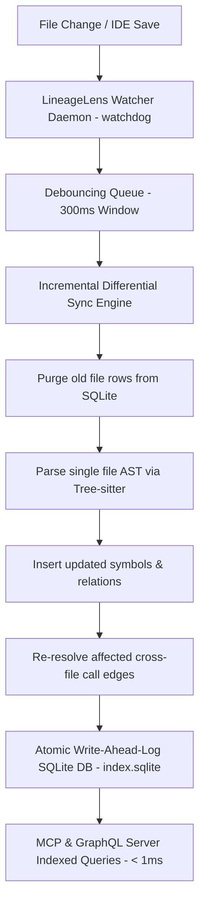

# Spec: Background Watcher Daemon & SQLite Index Storage Engine (`spec_watcher_index.md`)

## Overview

This specification defines the architecture for adding a **real-time background watcher daemon (`lineagelens watch`)** backed by an **atomic SQLite index store (`.lineagelens/index.sqlite`)** to LineageLens.

This feature enables LineageLens to incrementally update code lineage graphs on file saves in < 20ms without manual CLI calls, while serving sub-millisecond indexed queries to AI coding agents via MCP and GraphQL.

---

## Problem Statement

Currently:
1. **Manual Invocation Overhead**: LineageLens requires running `lineagelens analyze` manually or through git hooks to update `.lineagelens/graph.json`.
2. **Monolithic Serialization Bottleneck**: `graph.json` is stored as a single monolithic JSON file. Updating a single modified symbol in a 50MB codebase requires re-parsing the full codebase and writing out the entire 50MB JSON file.
3. **MCP Query Latency & Memory Overhead**: MCP server queries read and parse the complete JSON file into Python RAM on start, causing memory bloat for multi-module repositories.

---

## Solution Architecture



### 1. SQLite Storage Engine (`src/lineagelens/db.py`)
- Location: `.lineagelens/index.sqlite`
- Concurrency: Write-Ahead Logging mode (`PRAGMA journal_mode=WAL;` and `PRAGMA synchronous=NORMAL;`).
- Permits concurrent background watcher writes and active MCP reader reads without database lock contention.

#### Schema Definition (`DDL`):
```sql
CREATE TABLE IF NOT EXISTS files (
    id INTEGER PRIMARY KEY AUTOINCREMENT,
    path TEXT UNIQUE NOT NULL,
    lang TEXT NOT NULL,
    mtime REAL NOT NULL,
    hash TEXT NOT NULL
);

CREATE TABLE IF NOT EXISTS symbols (
    id TEXT PRIMARY KEY,
    file_id INTEGER NOT NULL,
    name TEXT NOT NULL,
    kind TEXT NOT NULL,
    module TEXT NOT NULL,
    line INTEGER NOT NULL,
    end_line INTEGER NOT NULL,
    parent_id TEXT,
    FOREIGN KEY(file_id) REFERENCES files(id) ON DELETE CASCADE
);

CREATE TABLE IF NOT EXISTS containers (
    id TEXT PRIMARY KEY,
    name TEXT NOT NULL,
    kind TEXT NOT NULL,
    parent_id TEXT
);

CREATE TABLE IF NOT EXISTS relations (
    id INTEGER PRIMARY KEY AUTOINCREMENT,
    source_id TEXT NOT NULL,
    target_id TEXT NOT NULL,
    kind TEXT NOT NULL,
    file_id INTEGER NOT NULL,
    line INTEGER NOT NULL,
    evidence_tier TEXT NOT NULL,
    evidence_label TEXT NOT NULL,
    resolution TEXT NOT NULL,
    FOREIGN KEY(file_id) REFERENCES files(id) ON DELETE CASCADE
);

CREATE TABLE IF NOT EXISTS reachability_cache (
    symbol_id TEXT PRIMARY KEY,
    verdict TEXT NOT NULL,
    rescue_reason TEXT
);

-- Performance Indexes
CREATE INDEX IF NOT EXISTS idx_symbols_file ON symbols(file_id);
CREATE INDEX IF NOT EXISTS idx_symbols_name ON symbols(name);
CREATE INDEX IF NOT EXISTS idx_relations_source ON relations(source_id);
CREATE INDEX IF NOT EXISTS idx_relations_target ON relations(target_id);
CREATE INDEX IF NOT EXISTS idx_relations_target_tier ON relations(target_id, evidence_tier);
```

---

### 2. Incremental Differential Sync (`src/lineagelens/incremental.py`)
- **Class**: `IncrementalAnalyzer`
- **Method**: `sync_file(project_root: Path, rel_file_path: str, db: SQLiteIndexDB)`
- **Workflow**:
  1. Purges previous symbols, relations, and file metadata for `rel_file_path` in an atomic transaction:
     ```sql
     DELETE FROM files WHERE path = ?;
     ```
  2. Runs single-file AST parsing via `TreeSitterAnalyzer` / `Analyzer`.
  3. Inserts newly parsed `Symbol`s, `Container`s, and candidate `Relation`s.
  4. Re-resolves call targets for relations originating from or targeting the updated file.
  5. Clears affected entries in `reachability_cache`.

---

### 3. Standalone Background Watcher Daemon (`src/lineagelens/watcher.py`)
- **Class**: `LineageLensWatcher`
- **Dependency**: `watchdog>=3.0.0`
- **Features**:
  - Monitors directory changes across `source_roots`.
  - Implements a `300ms` debouncing event queue (`DebouncedEventHandler`) to aggregate rapid file saves.
  - Controls process daemon lifecycle:
    - PID tracking in `.lineagelens/watcher.pid`.
    - `lineagelens watch --daemon`: Spawns detached background process.
    - `lineagelens watch --stop`: Sends `SIGTERM` to PID and cleans up lock files.
    - `lineagelens watch --status`: Returns running status, uptime, and last sync timestamp.

---

### 4. Query Layer & MCP Integration (`src/lineagelens/queries.py` & `mcp_server.py`)
- Updates `queries.py` and `mcp_server.py` to execute indexed SQL queries directly against `.lineagelens/index.sqlite` when present.
- Falls back transparently to `.lineagelens/graph.json` if SQLite index is not initialized.
- Leverages indexed `evidence_tier` columns to filter `deterministic_fact` vs `deterministic_heuristic` relations instantly.

---

### 5. CLI Extension (`src/lineagelens/cli.py`)
- **New Commands**:
  ```bash
  lineagelens watch [--daemon] [--stop] [--status]
  lineagelens sync <file>
  ```
- **Updated Command**:
  - `lineagelens analyze` populates both `.lineagelens/index.sqlite` and `.lineagelens/graph.json`.

---

### 6. Frontend Visualization & Web UI HUD Integration (`frontend/src/`)
- Integrates interactive visualization features directly into `frontend/src/`:
  1. **Compound Module Containers**: Cytoscape.js compound parent nodes grouping classes and functions inside module/file boundaries (`.py`, `.java`, `.ts`).
  2. **LOC-Proportional Node Sizing**: Dynamic symbol node radii scaled by lines of code (`end_line - line`).
  3. **Massive Objects Inspection Drawer**: Floating HUD panel listing symbols with >50 LOC for instant focus & zoom.
  4. **Unlinked & Reachability Drawer**: Dedicated tabs for orphan nodes (0 links), reachability verdicts (`dead`, `probably_dead`, `test_only`), and resiliency risks.
  5. **Live Display Scope Toggles**: HUD checkboxes to toggle visibility of Modules, Classes, Functions, External dependencies, and edge relation kinds.
  6. **Autocomplete Search & Lineage Highlight**: `Ctrl+F` search focusing on nodes and dimming non-lineage paths.

---

## Verification & Testing Strategy

### Unit Tests
- `tests/test_index_db.py`: Verifies SQLite schema creation, WAL mode enabling, atomic row purges, and index query speed.
- `tests/test_incremental.py`: Verifies single-file differential updates properly update symbols and relations without touching unrelated file records.
- `tests/test_watcher.py`: Tests `DebouncedEventHandler`, PID file creation/cleanup, daemon startup/stop, and event filtering.

### Manual Verification
1. Initialize a project using `lineagelens init .`.
2. Start the watcher: `lineagelens watch --daemon .`.
3. Verify `.lineagelens/watcher.pid` and `.lineagelens/index.sqlite` are created.
4. Modify a source file and verify incremental sync completes in < 20ms via `lineagelens watch --status`.
5. Stop the watcher daemon: `lineagelens watch --stop .`.

---

## Backward Compatibility & Data Safety
- `.lineagelens/graph.json` continues to be written during full analysis runs to maintain full backward compatibility with CI/CD dead-code ratchets (`lineagelens check`) and visualization tools.
- SQLite database corruption or schema migration auto-rebuilds cleanly from source files on detection.
